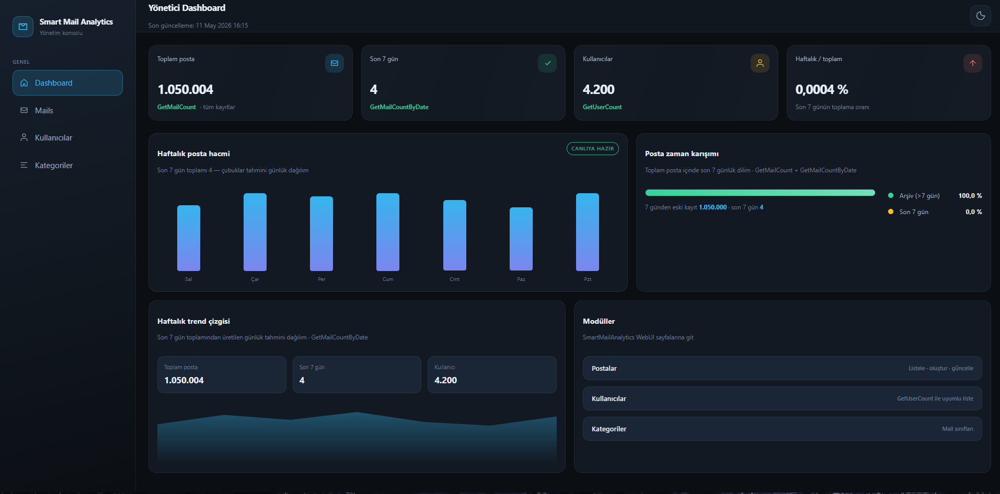
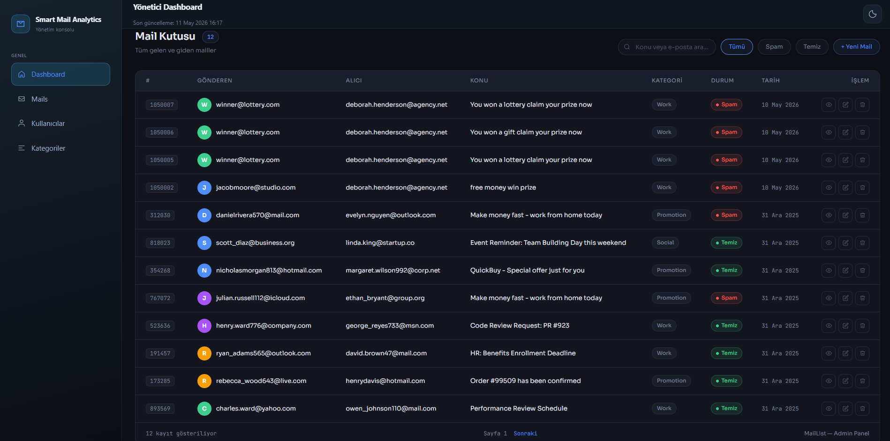
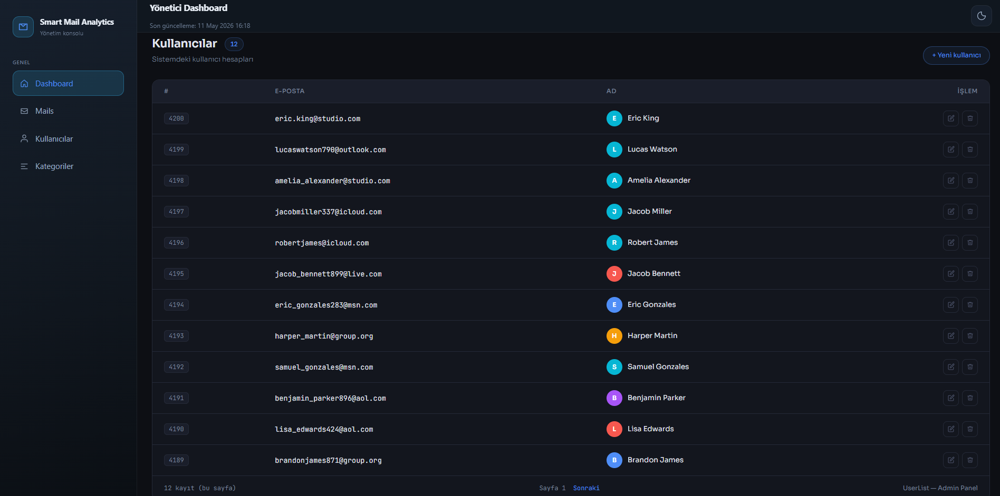
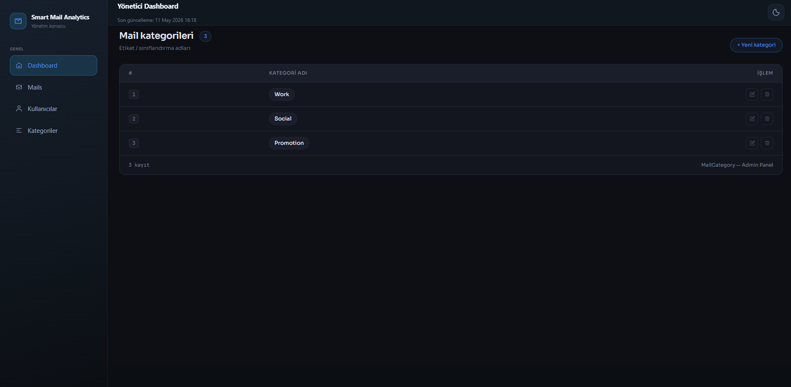
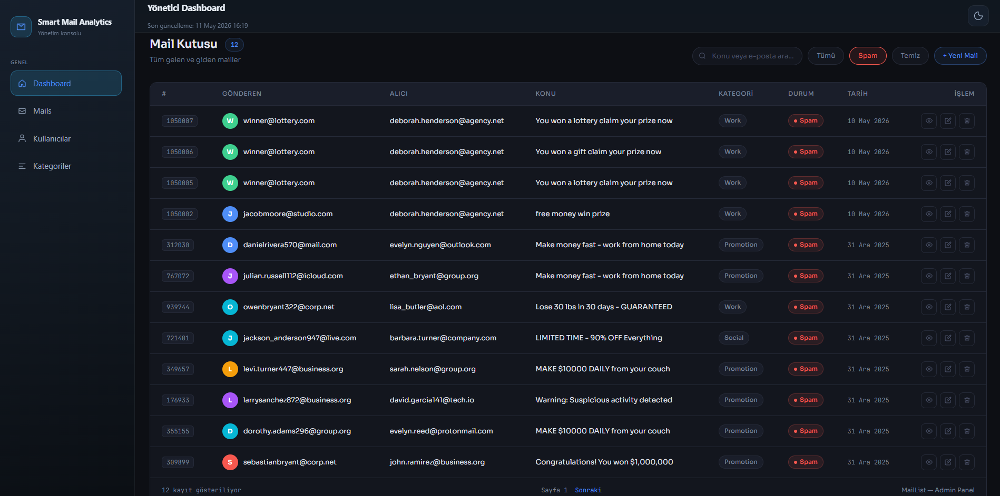
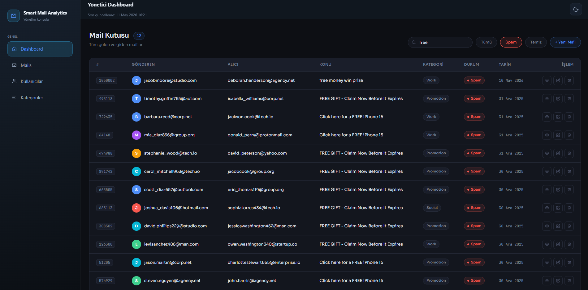
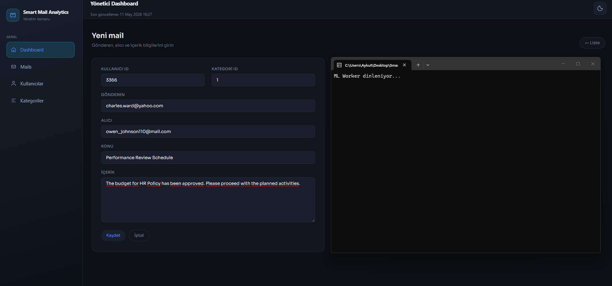
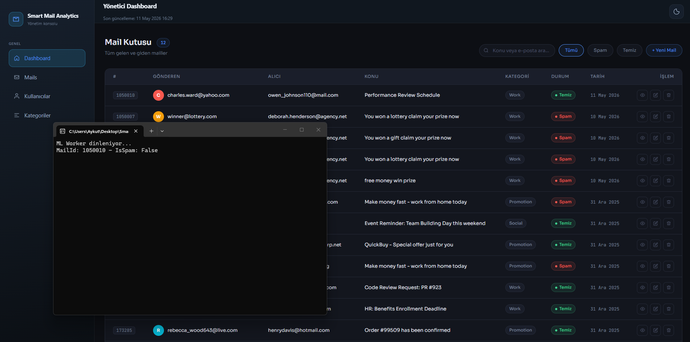
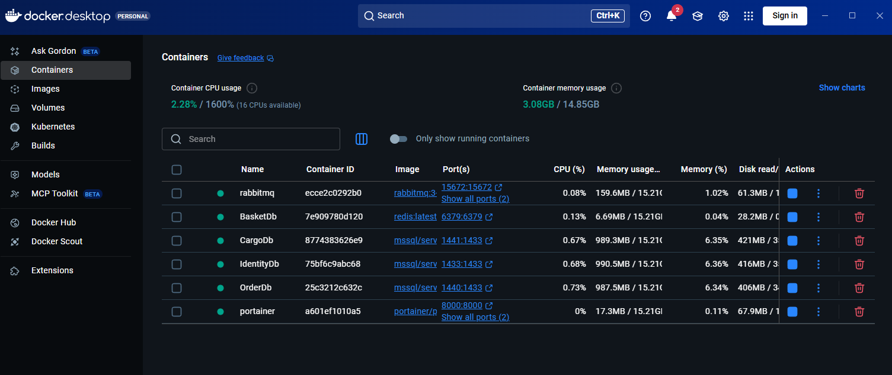
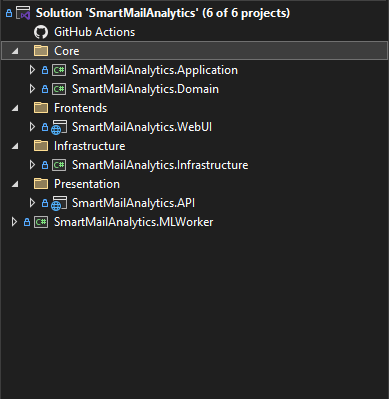

## 📨 SmartMailAnalytics

SmartMailAnalytics, ASP.NET Core 8.0 ile, kurumsal ortamlarda artan spam mail sorununa çözüm üretmek amacıyla geliştirilmiştir. Sistem, oluşturulan her maili RabbitMQ üzerinden ML.NET tabanlı bir sınıflandırma modeline ileterek otomatik spam tespiti yapar ve sonucu asenkron olarak veritabanına yansıtır.

---

## Özellikler

- E-posta kayıtları için CRUD işlemleri
- 1 milyondan fazla veri ile yüksek performanslı veri işleme, filtreleme ve görselleştirme.
- Filtreleme ve sayfalama (her sayfada 12 kayıt)
- **RabbitMQ** ile asenkron spam analizi
- **ML.NET** tabanlı ikili sınıflandırma modeli
- ASP.NET Core MVC ile web arayüzü ve dashboard
- Swagger ile dokümante edilmiş REST API

---

## Mimari

```
┌─────────────────────────────────────────────────────────┐
│                   SmartMailAnalytics                    │
│                                                         │
│  API ──► spam_request queue ──► MLWorker                │
│   ▲                                  │                  │
│   └────── spam_response queue ◄──────┘                  │
└─────────────────────────────────────────────────────────┘
```

1. Yeni bir mail oluşturulduğunda API, konu ve içeriği `spam_request` kuyruğuna yazar.
2. **MLWorker** konsol uygulaması kuyruğu dinler, ML.NET modeliyle tahmin üretir, sonucu `spam_response` kuyruğuna yazar.
3. API'deki `BackgroundService`, `spam_response` kuyruğunu dinler ve ilgili mailin `IsSpam` alanını veritabanında günceller.

---

## Proje Yapısı

```
SmartMailAnalytics/
├── Core/
│   ├── SmartMailAnalytics.Application      # Servisler, interface'ler, DTO'lar
│   └── SmartMailAnalytics.Domain           # Entity'ler
├── Infrastructure/
│   └── SmartMailAnalytics.Infrastructure  # Repository'ler, DB bağlantısı
├── Presentation/
│   └── SmartMailAnalytics.API             # Controller'lar, Swagger
└── SmartMailAnalytics.MLWorker            # RabbitMQ consumer + ML.NET
```

---

## Kullanılan Teknolojiler

| Katman | Teknoloji |
|---|---|
| Backend | ASP.NET Core 8.0 |
| Veri Erişimi | Dapper |
| Veritabanı | Microsoft SQL Server |
| Mesaj Kuyruğu | RabbitMQ |
| Makine Öğrenmesi | ML.NET (FastTree Binary Classification) |
| Web Arayüzü | ASP.NET Core MVC |
| API Dokümantasyonu | Swagger |

---

## ML.NET Model
- 1 milyondan fazla etiketli mail verisiyle eğitilmiştir.
- Konu (`Subject`) ve içerik (`Content`) metinleri `FeaturizeText` ile sayısal vektörlere dönüştürülür.
- Vektörler birleştirilip **FastTree** tabanlı ikili sınıflandırma ile eğitilir.
- Model ilk çalıştırmada `spam_model.zip` olarak diske kaydedilir, sonraki çalışmalarda direkt yüklenir.

---

## Notlar

Bu proje; Clean Architecture, asenkron mesaj kuyruğu ve ML.NET'i gerçek bir uygulama üzerinde bir arada deneyimlemek amacıyla geliştirilmiş bir öğrenme projesidir.

---

## 🖼️ Ekran Görüntüleri

### 🔐 Admin Paneli

<div align="center">
  
  
  
  
  
  
  
  
</div>

### 🔑 Container

<div align="center">
  
</div>

### 🗄️ Clean Architecture

<div align="center">
  
</div>
